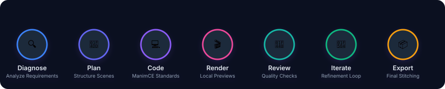

# 🎬 Manim Master Skill

<p align="center">
  
  
  
  
</p>

---

### ✨ A production-grade Claude Skill for creating accurate, beautiful, and reliable Manim Community Edition animations.

This repository helps Claude plan, code, render, debug, review, and refine mathematical and scientific animations using a disciplined workflow.

---

## 🌀 Dynamic Workflow Pipeline

Here is the structured journey every animation script undergoes:

<p align="center">
  
</p>

---

## 💡 What this is

**Manim Master Skill** is built for people who want Manim animations that are not just renderable, but actually useful as explanations.

It empowers Claude with a structured operating system for Manim work:

- 🚀 **Structured Animation Workflow** — From initial requirement diagnosis to final stitched export.
- 📐 **ManimCE-Specific Coding Rules** — Keeping code syntactically correct and fully compatible with the modern Community Edition API.
- 🎨 **Visual Design Rules** — Tailored color palettes, modern typography scales, and clean padding standards.
- 🔧 **Debugging Playbooks** — Structured guides to bypass common LaTeX, path, and library issues.
- 📦 **Tested Starter Templates** — High-quality templates to kickstart scenes with pre-configured aesthetics.
- 🥗 **Reusable Recipes** — Standard patterns for graphing, transforming equations, camera movement, and more.
- 📁 **Example Projects** — Fully worked-out examples showcasing production-grade code.
- 🧪 **CI Checks** — Automated syntax and structure validation to maintain repository health.
- 📋 **Review Checklists** — Step-by-step reviews for mathematical correctness, pacing, and visual style.

---

## 🎯 Why it exists

Most generated Manim code has at least one of these critical problems:

1. 💥 **It does not render** due to outdated library assumptions or syntactical deprecations.
2. 🔀 **It mixes ManimCE and ManimGL** API interfaces, creating broken scripts.
3. 🧹 **It looks cluttered** with default colors, improper font scaling, and crowded screens.
4. 🧠 **It teaches the concept unclearly**, failing to sequence the viewer's attention.
5. 🔍 **It has no debugging strategy** when complex transformations fail.
6. 🔁 **It has no review loop** for iterating and refining animations scene-by-scene.
7. 🛠️ **It ignores system issues** like LaTeX installation mismatches, ffmpeg path, and version problems.

This skill fixes those problems by giving Claude a **practical operating system** for Manim work.

---

## 🌟 Features

| Category | Features |
| :--- | :--- |
| **⚡ Core Engine** | Manim Community Edition first • Visual quality rules • Camera and 3D guidance |
| **🛠️ Utilities** | Planning templates • Scene-by-scene workflow • ffmpeg stitching helper |
| **📚 Library** | Recipes for common animation patterns • Tested starter templates • Example projects |
| **🛡️ Quality Assurance** | Smoke tests • GitHub Actions CI • Contribution guidelines |

---

## 📁 Repository Structure

<details>
<summary>📂 <b>Click to expand repository tree</b></summary>

```txt
manim-master-skill/
|-- README.md
|-- LICENSE
|-- CONTRIBUTING.md
|-- CODE_OF_CONDUCT.md
|-- SECURITY.md
|-- CHANGELOG.md
|-- ROADMAP.md
|-- pyproject.toml
|-- requirements-dev.txt
|-- .gitignore
|-- .github/
|   `-- workflows/
|       `-- ci.yml
|-- docs/
|   |-- architecture.md
|   |-- benchmarks.md
|   |-- claude-prompts.md
|   |-- design-principles.md
|   |-- manimce-vs-manimgl.md
|   `-- release-checklist.md
|-- examples/
|   |-- derivative_sine/
|   |-- vector_addition/
|   `-- binary_search/
|-- recipes/
|   |-- animate_equation_transform.md
|   |-- create_graph_scene.md
|   |-- debug_latex.md
|   |-- make_subtitles.md
|   |-- stitch_scenes.md
|   |-- use_updaters_safely.md
|   `-- use_value_tracker.md
|-- skills/
|   `-- manim-master/
|       |-- SKILL.md
|       |-- workflow.md
|       |-- troubleshooting.md
|       |-- visual_quality.md
|       |-- manimce_rules.md
|       |-- rules/
|       |   |-- animations.md
|       |   |-- camera.md
|       |   |-- colors.md
|       |   |-- graphs.md
|       |   |-- latex.md
|       |   |-- mobjects.md
|       |   |-- performance.md
|       |   |-- scenes.md
|       |   |-- text.md
|       |   |-- three_d.md
|       |   |-- updaters.md
|       |   `-- value_trackers.md
|       |-- templates/
|       |   |-- manim.cfg
|       |   |-- plan.template.md
|       |   |-- review.checklist.md
|       |   `-- script.template.py
|       `-- tools/
|           |-- render_all.py
|           `-- stitch.py
|`-- tests/
|   |-- smoke_scene.py
|   |-- test_no_hidden_unicode.py
|   |-- test_skill_structure.py
|   `-- test_python_syntax.py
```
</details>

---

## 📥 Install the skill

To add this skill to your AI assistant:
```bash
npx skills add MadhurMishraX/manim-master-skill/skills/manim-master
```

---

## 💻 Install ManimCE locally

Set up a clean virtual environment and install the core dependencies:

### 🐧 macOS & Linux
```bash
python -m venv .venv
source .venv/bin/activate
pip install manim
```

### 🪟 Windows PowerShell
```powershell
python -m venv .venv
.venv\Scripts\Activate.ps1
pip install manim
```

### 🔍 Verify installation:
```bash
python --version
manim --version
ffmpeg -version
```

> [!TIP]
> **For `MathTex` Support:** You will need a LaTeX distribution installed on your machine:
> * 🍏 **macOS:** MacTeX
> * 🐧 **Linux:** TeX Live
> * 🪟 **Windows:** MiKTeX

---

## 🚀 Quick start prompt

To get started, try prompting Claude with:

```txt
Create a Manim animation explaining why the derivative of sin(x) is cos(x).
Use a unit circle visual first, then connect it to the limit idea.
Make it 16:9, about 90 seconds, with clean subtitles.
```

Upon execution, Claude will create a clean, structured workspace:

```txt
project-name/
|-- plan.md
|-- script.py
|-- manim.cfg
|-- concat.txt
|-- final.mp4
`-- media/
```

---

## 🛠️ Developer Rendering Workflow

Use these commands to render, stitch, and test your scenes:

### 🎬 Development Render (Low quality, fast render)
```bash
manim -ql script.py Scene1_Hook
```

### 🏆 Final Render (High quality)
```bash
manim -qh script.py Scene1_Hook Scene2_CoreIdea Scene3_Conclusion
```

### 🧵 Stitch scenes
Combine all independent scene renders into a single high-quality video file:
```bash
python skills/manim-master/tools/stitch.py --media-dir media/videos/script/480p15 --output final.mp4
```

### 🧪 Run tests
```bash
pip install -r requirements-dev.txt
pytest
```

---

## 🧠 Design philosophy

> *"A good mathematical animation is not decoration. It is a controlled sequence of attention."*

This skill treats animation like explanation:

* 🔍 **Define the confusion** — Pinpoint the central question or challenge.
* 🏗️ **Build a visual model** — Introduce a clean geometric representation.
* 🔗 **Connect visual to notation** — Bridge the gap between the shape and the math symbols.
* 📈 **Reveal the pattern** — Animate the transformation or continuous variation.
* 🏁 **Finish with a clean takeaway** — End on a high-contrast final frame that sticks in the viewer's memory.

---

## 📄 License

This repository is licensed under the [MIT License](LICENSE).
